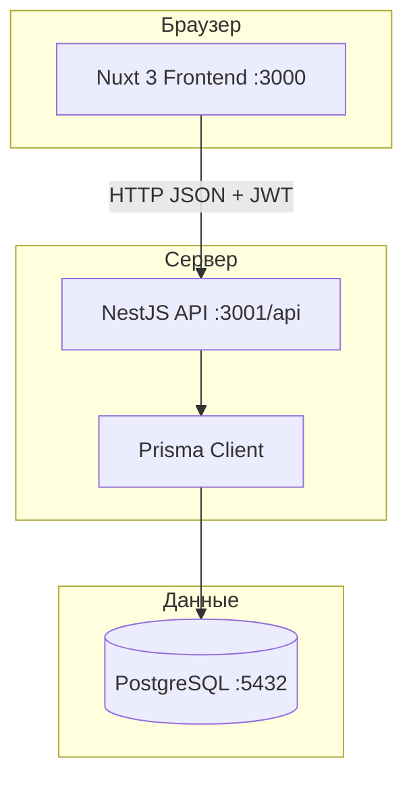
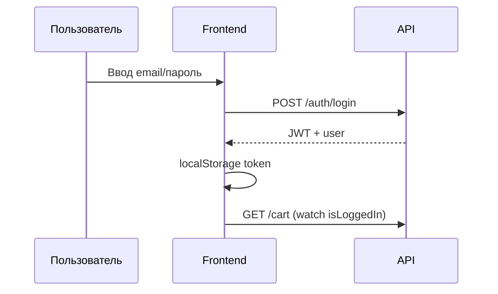
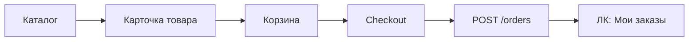
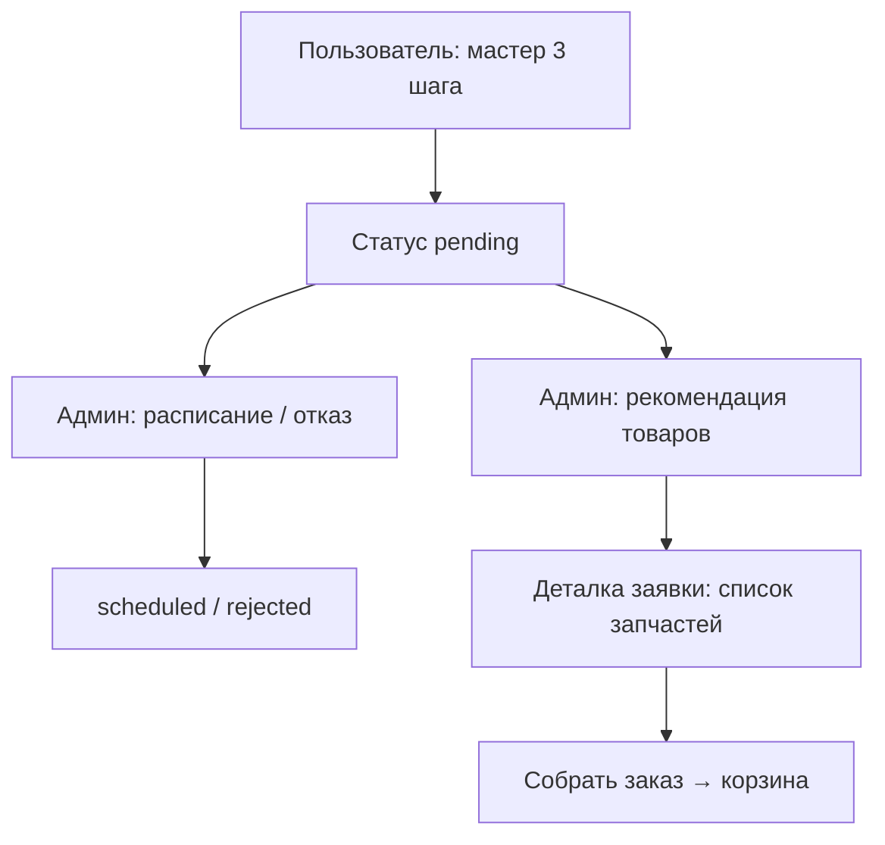

# АвтоДеталь — техническая документация проекта (для подготовки диплома)

Документ описывает веб-приложение **«АвтоДеталь»** — интернет-магазин автозапчастей с личным кабинетом, подбором деталей по автомобилю из «Моего гаража», корзиной, оформлением заказов и модулем **записи на СТО** (автосервис) с администрированием заявок и рекомендацией запчастей.

Целевая аудитория документа: ИИ или человек, которому нужно **полностью понять систему** для написания пояснительной записки, глав, схем, UML и описания функциональных требований.

---

## 1. Общая архитектура

### 1.1. Назначение системы

Система решает задачи:

1. **E-commerce** — просмотр каталога, фильтрация, карточка товара, корзина, оформление заказа с доставкой.
2. **Персонализация** — учёт автомобилей пользователя («Мой гараж») и подсветка совместимых запчастей в каталоге.
3. **Сервисное обслуживание** — онлайн-запись в партнёрский автосервис (СТО), обработка заявок администратором, назначение времени, рекомендация запчастей из каталога магазина.
4. **Администрирование** — управление товарами, заказами, пользователями, автосервисами и заявками на СТО.

### 1.2. Технологический стек

| Слой | Технологии |
|------|------------|
| **Frontend** | Nuxt 3 (Vue 3, SSR), TypeScript, file-based routing, composables, `@nuxt/icon` (Lucide) |
| **Backend** | NestJS 10, TypeScript, REST API с префиксом `/api` |
| **БД** | PostgreSQL 16, ORM Prisma 6 |
| **Аутентификация** | JWT (Bearer), bcrypt для паролей |
| **Валидация API** | class-validator, class-transformer (глобальный `ValidationPipe`) |
| **Инфраструктура** | Docker Compose (postgres, seed, backend, frontend) |

### 1.3. Архитектурный стиль

Классическая **клиент–серверная** архитектура с разделением на SPA/SSR-фронтенд и REST-бэкенд:



**Особенности фронтенда:**

- Запросы к API через composable `useApi()` → `$fetch`.
- На **сервере (SSR)** используется `runtimeConfig.apiBase` (в Docker: `http://backend:3001/api`).
- В **браузере** — `runtimeConfig.public.apiBase` (`http://localhost:3001/api`).
- JWT хранится в `localStorage` (`autodetail-token`), состояние пользователя — в `useState` Nuxt.

**Особенности бэкенда:**

- Модули NestJS по доменам: `auth`, `catalog`, `garage`, `cart`, `orders`, `users`, `service-booking`, `admin`.
- Публичные эндпоинты каталога и СТО; защищённые — `JwtAuthGuard`; админские — `JwtAuthGuard` + `AdminGuard` (`role === admin`).
- Для каталога опционально передаётся JWT (`OptionalJwtAuthGuard`) — чтобы работал фильтр «по гаражу» для авторизованных.

### 1.4. Структура репозитория

```
Магазин автозапчастей/
├── docker-compose.yml      # Postgres + seed + backend + frontend
├── README.md               # Краткая инструкция по запуску
├── README_DIPLOMA.md       # Этот файл (полное описание)
├── backend/
│   ├── prisma/
│   │   ├── schema.prisma   # Модели БД
│   │   ├── seed.ts         # Категории, ~52 товара, пользователи, гараж демо
│   │   └── seed-service.ts # 8 видов работ СТО, 40 автосервисов
│   ├── src/
│   │   ├── main.ts         # Префикс api, CORS, ValidationPipe
│   │   ├── app.module.ts
│   │   ├── auth/           # register, login, JWT
│   │   ├── catalog/        # Товары, категории, поиск, popular
│   │   ├── garage/         # CRUD автомобилей пользователя
│   │   ├── cart/           # Корзина
│   │   ├── orders/         # Заказы пользователя
│   │   ├── users/          # Профиль
│   │   ├── service-booking/# СТО, заявки, админ СТО
│   │   ├── admin/          # Товары, заказы, пользователи (админ)
│   │   ├── common/         # fitment, product.mapper
│   │   └── prisma/
│   └── package.json
└── frontend/
    ├── nuxt.config.ts
    ├── pages/              # Маршруты (см. раздел 2)
    ├── components/         # UI по доменам
    ├── composables/        # useApi, useUser, useCart, useGarage, …
    ├── middleware/         # auth.ts, admin.ts
    ├── layouts/            # default, admin
    └── data/               # Типы, константы фильтров, статусы (часть дублирует контракт API)
```

### 1.5. Запуск проекта

#### Docker (рекомендуется)

```bash
docker compose up --build
# при ошибке имени проекта из-за кириллицы в пути:
docker compose -p autodetail up --build
```

| Сервис | URL / порт |
|--------|------------|
| Frontend | http://localhost:3000 |
| API | http://localhost:3001/api |
| PostgreSQL | localhost:5432 (user/pass/db: `autodetail`) |

Порядок контейнеров: `postgres` → `seed` (однократное заполнение) → `backend` → `frontend`.

Переменные фронтенда в Docker:

- `NUXT_PUBLIC_API_BASE=http://localhost:3001/api` — для браузера.
- `NUXT_API_BASE=http://backend:3001/api` — для SSR внутри сети Docker.

#### Локальная разработка

**Backend:**

```bash
cd backend
cp .env.example .env   # DATABASE_URL, JWT_SECRET
npm install
npx prisma migrate deploy
npx prisma db seed
npm run start:dev      # http://localhost:3001/api
```

**Frontend:**

```bash
cd frontend
npm install
# NUXT_PUBLIC_API_BASE=http://localhost:3001/api
npm run dev            # http://localhost:3000
```

После изменения `schema.prisma`: `npx prisma migrate dev` / `migrate deploy` и при необходимости пересборка seed.

### 1.6. Учётные записи для тестирования (seed)

| Роль | Email | Пароль |
|------|-------|--------|
| Покупатель | `demo@autodetail.ru` | `demo12345` |
| Администратор | `admin@admin.ru` | `test_test` |

У демо-пользователя в seed создаются 2 автомобиля в гараже (Toyota Camry — основной, Volkswagen Polo).

### 1.7. Модель данных (Prisma) — краткий обзор

**Пользователи и роли**

- `User`: email, password (hash), `role` (`user` | `admin`), fullName, phone, birthDate.
- Связи: `cartItems`, `orders`, `garageVehicles`, `serviceAppointments`.

**Каталог магазина**

- `Category`: id = slug (`engine`, `brakes`, `suspension`, `electrics`).
- `Product`: цена в **копейках/рублях как Int** (в проекте целые рубли), OEM, SKU, `attributes` (JSON: partType, axle, voltage, **fitment**), `highlights` (JSON).

**Корзина и заказы**

- `CartItem`: уникальная пара `(userId, productId)`, `quantity`; при повторном добавлении — **upsert** (количество суммируется).
- `Order` + `OrderItem`: снимок товара на момент заказа; статусы `OrderStatus`; доставка `DeliveryMethod`.

**Гараж**

- `GarageVehicle`: brand, model, year, vin?, nickname?, `isDefault`.

**СТО (service booking)**

- `ServiceCategory` — виды работ (ТО, тормоза, диагностика и т.д., 8 штук).
- `AutoService` — автосервис (название, город, адрес, рейтинг, режим работы).
- `AutoServiceOnCategory` — M:N сервис ↔ виды работ.
- `ServiceAppointment` — заявка: номер, авто из гаража, СТО, описание проблемы, статус (`pending` | `scheduled` | `rejected`), `scheduledAt`, `rejectReason`.
- `ServiceAppointmentOnCategory` — выбранные пользователем виды работ (1–2).
- `ServiceAppointmentRecommendation` — рекомендованные админом товары из каталога.

### 1.8. Сквозные бизнес-правила

1. **Совместимость (fitment)** — в `attributes.fitment` массив `{ carBrand, carModel, yearFrom, yearTo }`. При запросе каталога с `garageVehicleId` товары фильтруются; на карточке может быть плашка `garageMatchLabel`.
2. **Корзина** — только для авторизованных; гость при «В корзину» видит модалку входа.
3. **Заказ** — создаётся из корзины; корзина очищается; доставка: курьер / самовывоз / почта; стоимость доставки: самовывоз 0; при сумме ≥ 10000 — 0; иначе курьер 490 ₽, почта 350 ₽.
4. **Запись в СТО** — 3 шага: авто → виды работ (макс. 2) + описание (мин. 10 символов) → выбор СТО (фильтр по выбранным категориям). Заявка создаётся со статусом `pending`.
5. **Рекомендации запчастей** — админ подбирает товары с учётом fitment авто из заявки; пользователь видит блок на деталке заявки; кнопка **«Собрать заказ»** добавляет все рекомендации в корзину и ведёт в `/cart`. Повторный сбор для той же заявки блокируется флагом в `localStorage` (`autodetail-service-built-orders`).

### 1.9. Маршрутизация и защита страниц (frontend)

| Middleware | Назначение |
|------------|------------|
| `auth` | Доступ только авторизованным; иначе редирект на `/?auth=required` |
| `admin` | Роль `admin`; иначе на главную |

Layout `admin` — отдельная оболочка админ-панели (боковое меню).

---

## 2. Модули системы (детально)

Ниже каждый функциональный модуль описан с точки зрения **страниц**, **сценариев** и **API**.

---

### 2.1. Регистрация и авторизация

#### Назначение

Идентификация пользователя, разграничение ролей `user` / `admin`, доступ к корзине, гаражу, заказам и СТО.

#### UI

- **Модальное окно** `components/auth/AuthModal.vue` (Teleport в `body`, глобальные стили в `assets/css/main.css`).
- Открывается через `useAuthModal()`: `openLogin()`, `openRegister()`, `close()`.
- Точки входа: кнопки в шапке, блоки «Гараж» / корзина для гостя, query `?auth=required` после редиректа middleware.

**Вкладка «Вход»:** email, пароль → `POST /api/auth/login` → сохранение JWT → редирект: админ на `/admin/orders`, пользователь на `/account`.

**Вкладка «Регистрация»:** ФИО, дата рождения (опц.), телефон, email, пароль → `POST /api/auth/register` → автоматический вход → `/account`.

Демо-подсказки с паролями в UI **убраны** (по требованию заказчика).

#### Backend

| Метод | Путь | Описание |
|-------|------|----------|
| POST | `/api/auth/register` | Создание пользователя, хеш пароля bcrypt |
| POST | `/api/auth/login` | Проверка пароля, выдача `{ accessToken, user }` |
| GET | `/api/auth/me` | Текущий пользователь (JWT) |

#### Composables

- `useUser()` — `login`, `register`, `logout`, `fetchMe`, `isLoggedIn`, `isAdmin`, `loadFromStorage`.
- `useApi()` — подстановка `Authorization: Bearer …`.

#### Диаграмма входа



---

### 2.2. Каталог запчастей

#### Назначение

Просмотр и поиск автозапчастей по 4 категориям, фильтрация, сортировка, подбор по автомобилю из гаража, добавление в корзину.

#### Категории товаров (магазин)

| slug | Название |
|------|----------|
| `engine` | Двигатель |
| `brakes` | Тормозная система |
| `suspension` | Подвеска |
| `electrics` | Электрика |

В seed: **~13 товаров на категорию** (~52 всего), бренды Bosch, Mann-Filter, NGK и др.

#### Страницы (frontend)

| URL | Файл | Содержание и функции |
|-----|------|----------------------|
| `/catalog` | `pages/catalog/index.vue` | Сетка категорий, переход в раздел |
| `/catalog/:category` | `pages/catalog/[category].vue` | Список товаров: сайдбар фильтров (`CatalogSidebar`, `CatalogFilters`), тулбар сортировки/вида, пагинация, фильтр **«По моему гаражу»** (`CatalogGarageFilter`) — передаёт `garageVehicleId` в API |
| `/catalog/:category/:id` | `pages/catalog/[category]/[id].vue` | Карточка товара: `ProductDetailShell`, блоки характеристик по категории (`DetailEngine`, `DetailBrakes`, …), похожие товары (`RelatedProducts`), кнопка «В корзину» (`ProductCartControl`) |

#### Компоненты каталога

- `ProductCard` — изображение-заглушка, бейджи (Акция, В наличии/Под заказ, категория, «Подходит для …»), цена, рейтинг, кнопка корзины.
- Фильтры заданы статически во `frontend/data/catalog.ts` и на бэкенде в `catalog.service` / `category-attribute-fields.ts` (partType, brand, axle, voltage, inStock, price range).

#### Backend API

| Метод | Путь | Примечание |
|-------|------|------------|
| GET | `/api/catalog/categories` | Список категорий из БД |
| GET | `/api/catalog/products?category=&page=&pageSize=&sort=&…` | Фильтры + пагинация; опционально JWT + `garageVehicleId` |
| GET | `/api/catalog/products/:id` | Одна карточка |
| GET | `/api/catalog/products/:id/related?category=` | Похожие |
| GET | `/api/catalog/search?q=` | Поиск (шапка — форма пока без полной привязки к странице результатов) |
| GET | `/api/catalog/popular?limit=` | Популярные по `reviewsCount` (компоненты главной для этого есть, **с главной страницы блоки убраны**) |

#### Сортировка

`popular` (по числу отзывов), `price_asc`, `price_desc`, `name_asc`, `rating_desc`.

---

### 2.3. Корзина и оформление заказа (вне ЛК, но часть покупательского сценария)

#### Страницы

| URL | Описание |
|-----|----------|
| `/cart` | Список позиций (`CartLineItem`), итог (`CartSummary`), изменение количества, удаление, переход к оформлению |
| `/checkout` | Форма: ФИО, телефон, способ доставки, адрес, комментарий; расчёт доставки; `POST /api/orders` → очистка корзины → редирект в ЛК |

Требуется авторизация для осмысленной работы корзины (API под JWT).

#### API корзины

| Метод | Путь |
|-------|------|
| GET | `/api/cart` |
| POST | `/api/cart/items` body: `{ productId, quantity }` |
| PATCH | `/api/cart/items/:productId` |
| DELETE | `/api/cart/items/:productId` |
| DELETE | `/api/cart` |

`useCart()` — `add`, `addMany` (для «Собрать заказ» из СТО), `setQuantity`, `remove`, `clear`, `refresh`, счётчик в шапке.

---

### 2.4. Личный кабинет — профиль и заказы

#### Общая оболочка

- Все страницы `/account/*` (кроме вложенных без layout): **боковое меню** `AccountNav` + контент.
- Пункты: Мои заказы, Запись в СТО, Мой гараж, Профиль, Выход.

#### 2.4.1. Профиль

| URL | Файл |
|-----|------|
| `/account/profile` | `pages/account/profile.vue` |

**Функции:** просмотр и редактирование ФИО, телефона, даты рождения, email (только чтение). API: `GET/PATCH /api/users/profile`.

#### 2.4.2. Мои заказы

| URL | Файл |
|-----|------|
| `/account` | `pages/account/index.vue` — список заказов |
| `/account/orders/:id` | `pages/account/orders/[id].vue` — детализация |

**Функции списка:**

- Загрузка `GET /api/orders?status=`.
- Фильтры по статусу (вкладки): все, `pending_confirmation`, `in_progress`, `awaiting_pickup`, `completed`.
- Поиск по номеру заказа и названию товара (клиентский).
- Карточки `OrderCard` со статус-бейджами `OrderStatusBadge`.

**Деталка заказа:**

- Состав (`OrderDetailComposition`), подсказки по статусу (`OrderDetailHints`).
- Действие пользователя: **подтвердить получение** → `PATCH /api/orders/:id/complete` (перевод в `completed` при допустимом статусе).

#### Статусы заказа

| Код | Пользовательское название |
|-----|---------------------------|
| `pending_confirmation` | В ожидании подтверждения |
| `in_progress` | В работе |
| `awaiting_pickup` | Ожидает получения |
| `completed` | Завершён |

---

### 2.5. Модуль «Мой гараж»

#### Назначение

Хранение автомобилей пользователя для персонализации каталога и для записи на СТО (выбор авто на шаге 1 мастера).

#### Страница

| URL | Файл |
|-----|------|
| `/account/garage` | `pages/account/garage.vue` |

**Middleware:** `auth`.

**Функции:**

- Список автомобилей (карточки: марка, модель, год, VIN, nickname, метка «основной»).
- Добавление / редактирование через модалку `GarageVehicleFormModal`.
- Удаление с подтверждением `ConfirmModal`.
- Назначение автомобиля по умолчанию (`PATCH …/default`).
- На **главной** блок `HomeGarageBlock`: призыв добавить авто; для авторизованных — ссылка в гараж; для гостей — вход.

#### API

| Метод | Путь |
|-------|------|
| GET | `/api/garage` |
| POST | `/api/garage` |
| PATCH | `/api/garage/:id` |
| PATCH | `/api/garage/:id/default` |
| DELETE | `/api/garage/:id` |

Composable: `useGarage()`.

#### Связь с каталогом

При выборе авто в `CatalogGarageFilter` в запрос товаров передаётся `garageVehicleId` — бэкенд отфильтровывает по fitment и добавляет `garageMatchLabel` на карточки.

---

### 2.6. Модуль «Запись в СТО»

#### Назначение

Пользователь записывается в партнёрский автосервис на выбранные виды работ. Администратор обрабатывает заявку: подтверждает время, отклоняет или меняет расписание, рекомендует запчасти из каталога магазина.

#### Виды работ (ServiceCategory) — seed

`maintenance`, `brakes`, `suspension`, `engine`, `diagnostics`, `tires`, `alignment`, `electrics` — с русскими названиями (ТО, тормоза, подвеска, двигатель, диагностика, шиномонтаж, развал-схождение, электрика).

#### Автосервисы

- Seed создаёт **40 СТО** в городах (Москва, СПб, Казань, …) с привязкой к 1–3 категориям работ.
- Публичный API фильтрует сервисы по `categories` (через запятую).

#### Страницы пользователя

| URL | Файл | Описание |
|-----|------|----------|
| `/account/service` | `pages/account/service/index.vue` | Список заявок `ServiceAppointmentCard`, фильтр по статусу, кнопка «Новая запись» |
| `/account/service/book` | `pages/account/service/book.vue` | **Мастер из 3 шагов** (см. ниже) |
| `/account/service/:id` | `pages/account/service/[id].vue` | Деталка заявки |

**Мастер записи (`book.vue`):**

1. **Автомобиль** — выбор из гаража (обязательно хотя бы один авто).
2. **Работы и проблема** — чекбоксы категорий (**не более 2**), текст проблемы **≥ 10 символов**.
3. **Автосервис** — список СТО `GET /api/service-centers?categories=…`, выбор одного → `POST /api/service-appointments` → редирект на деталку с `?created=1`.

**Деталка заявки (`[id].vue`):**

- Номер заявки, СТО, адрес, авто, запрошенные работы, описание проблемы.
- **Статус `pending`:** оранжевый блок «Ожидайте подтверждения».
- **Статус `scheduled`:** зелёный блок с датой/временем записи.
- **Статус `rejected`:** причина отклонения.
- **Рекомендованные запчасти** (если админ назначил): список с ценами и ссылками в каталог; кнопка **«Собрать заказ»** (однократно, см. п. 1.8).

#### Главная страница — блок СТО

`HomeStoPartners` — баннер + **3 случайных** партнёра `GET /api/service-centers/featured?limit=3`, ссылка на запись (`/account/service/book` для авторизованных).

#### API пользователя (JWT)

| Метод | Путь |
|-------|------|
| GET | `/api/service-categories` |
| GET | `/api/service-centers` |
| GET | `/api/service-centers/featured` |
| GET | `/api/service-centers/:id` |
| GET | `/api/service-appointments` |
| GET | `/api/service-appointments/:id` |
| POST | `/api/service-appointments` |

Тело создания: `{ garageVehicleId, autoServiceId, categoryIds[], problemDescription }`.

#### Статусы заявки

| Статус | Смысл |
|--------|--------|
| `pending` | Ожидает решения админа |
| `scheduled` | Назначена дата (`scheduledAt`) |
| `rejected` | Отклонена (`rejectReason`) |

---

### 2.7. Администрирование

Доступ: роль `admin`, layout `layouts/admin.vue`, middleware `admin`.

Точка входа: `/admin` → редирект на `/admin/orders`.

#### 2.7.1. Заказы

| URL | Файл |
|-----|------|
| `/admin/orders` | `pages/admin/orders.vue` |

- Таблица заказов, фильтр по статусу.
- Модалка `OrderDetailModal` — состав, клиент, смена статуса.
- API: `GET /api/admin/orders`, `GET /api/admin/orders/:id`, `PATCH /api/admin/orders/:id/status`.

#### 2.7.2. Товары

| URL | Файл |
|-----|------|
| `/admin/products` | `pages/admin/products/index.vue` — список |
| `/admin/products/new` | `pages/admin/products/new.vue` — создание |
| `/admin/products/:id` | `pages/admin/products/[id].vue` — редактирование |

- Форма `ProductForm`: категория, название, бренд, цены, OEM/SKU, наличие, описание, JSON-атрибуты по полям категории (`GET /api/admin/products/category-fields`).
- API: полный CRUD `/api/admin/products`.

#### 2.7.3. Пользователи

| URL | Файл |
|-----|------|
| `/admin/users` | `pages/admin/users.vue` |

- Список, создание/редактирование/удаление пользователей, смена роли.
- `UserHistoryModal` — история заказов пользователя `GET /api/admin/users/:id/orders`.
- API: CRUD `/api/admin/users`.

#### 2.7.4. Заявки на СТО (сервис)

| URL | Файл |
|-----|------|
| `/admin/service-requests` | `pages/admin/service-requests.vue` |

**Функции:**

- Таблица заявок, фильтр по статусу.
- `ServiceAppointmentDetailModal` — полная информация, кнопки:
  - **Записать / Изменить время** → `PATCH /api/admin/service-appointments/:id/schedule` (`scheduledAt`).
  - **Отклонить** → `PATCH …/reject` (доступно и для уже запланированных — отмена/отклонение).
  - **Рекомендовать товары** → модалка `ServiceRecommendProductsModal`: поиск по каталогу с фильтром fitment `GET …/recommendable-products`, сохранение `PUT …/recommended-products` с массивом `productIds`.

#### 2.7.5. Автосервисы (справочник СТО)

| URL | Файл |
|-----|------|
| `/admin/auto-services` | `pages/admin/auto-services/index.vue` |
| `/admin/auto-services/new` | `pages/admin/auto-services/new.vue` |
| `/admin/auto-services/:id` | `pages/admin/auto-services/[id].vue` |

- Форма `AutoServiceForm`: название, город, адрес, описание, рейтинг, режим работы, телефон, привязка категорий работ.
- API: `GET/POST/PATCH/DELETE /api/admin/auto-services`, категории `GET /api/admin/auto-services/categories`.

Composable: `useAdminService()` (в `useServiceBooking.ts`), `useAdmin()` для заказов/товаров/пользователей.

---

### 2.8. Главная страница (публичная витрина)

| URL | Файл |
|-----|------|
| `/` | `pages/index.vue` |

**Секции (актуальный состав):**

1. `HomeHeroSection` — УТП, кнопки в каталог и регистрацию, ссылка «Мой гараж».
2. `HomeFeatureBanners` — преимущества магазина.
3. `HomeGarageBlock` — блок гаража (см. 2.5).
4. `HomeStoPartners` — партнёры СТО (см. 2.6).

Компоненты `HomePopularProducts` и `HomeCategoryProducts` **в разметке главной не используются** (файлы в репозитории сохранены).

---

## 3. Сводная таблица API

### Публичные / опциональная авторизация

```
GET  /api/catalog/*
GET  /api/service-categories
GET  /api/service-centers/*
POST /api/auth/register
POST /api/auth/login
```

### Пользователь (JWT)

```
GET    /api/auth/me
GET    /api/users/profile
PATCH  /api/users/profile
GET    /api/garage
POST   /api/garage
PATCH  /api/garage/:id
PATCH  /api/garage/:id/default
DELETE /api/garage/:id
GET    /api/cart
POST   /api/cart/items
PATCH  /api/cart/items/:productId
DELETE /api/cart/items/:productId
DELETE /api/cart
GET    /api/orders
GET    /api/orders/:id
POST   /api/orders
PATCH  /api/orders/:id/complete
GET    /api/service-appointments
GET    /api/service-appointments/:id
POST   /api/service-appointments
```

### Администратор (JWT + role admin)

```
GET    /api/admin/orders
GET    /api/admin/orders/:id
PATCH  /api/admin/orders/:id/status
GET    /api/admin/products
GET    /api/admin/products/category-fields
GET    /api/admin/products/:id
POST   /api/admin/products
PATCH  /api/admin/products/:id
DELETE /api/admin/products/:id
GET    /api/admin/users
GET    /api/admin/users/:id
GET    /api/admin/users/:id/orders
POST   /api/admin/users
PATCH  /api/admin/users/:id
DELETE /api/admin/users/:id
GET    /api/admin/service-appointments
GET    /api/admin/service-appointments/:id
GET    /api/admin/service-appointments/:id/recommendable-products
PUT    /api/admin/service-appointments/:id/recommended-products
PATCH  /api/admin/service-appointments/:id/schedule
PATCH  /api/admin/service-appointments/:id/reject
GET    /api/admin/auto-services
GET    /api/admin/auto-services/categories
GET    /api/admin/auto-services/:id
POST   /api/admin/auto-services
PATCH  /api/admin/auto-services/:id
DELETE /api/admin/auto-services/:id
```

---

## 4. Ключевые composables и состояние (frontend)

| Composable | Назначение |
|------------|------------|
| `useApi` | HTTP-клиент, JWT, `ApiError` |
| `useUser` | Авторизация, профиль, роли |
| `useAuthModal` | Модалка входа/регистрации |
| `useCart` | Корзина, счётчик в шапке |
| `useCatalogList` | Состояние списка каталога (фильтры, страница) |
| `useGarage` | CRUD гаража |
| `useOrders` | Заказы пользователя |
| `useServiceBooking` | СТО для пользователя |
| `useAdminService` | СТО и заявки для админа |
| `useAdmin` | Товары, заказы, пользователи (админ) |
| `useToast` | Всплывающие уведомления |

Глобальные UI: `AppHeader`, `AppFooter`, `AuthModal`, `AppToast`, layout `default`.

---

## 5. Диаграммы основных процессов

### 5.1. Покупка запчастей



### 5.2. Запись в СТО и рекомендации



---

## 6. Что указать в дипломе (подсказки для ИИ-автора)

1. **Предметная область:** розничная продажа автозапчастей + смежная услуга записи на сервис с кросс-продажей рекомендованных деталей.
2. **Роли:** гость (просмотр каталога, модалка входа), покупатель, администратор.
3. **Технологии:** SPA/SSR (Nuxt), REST API (NestJS), реляционная БД (PostgreSQL), контейнеризация (Docker).
4. **Нефункциональные аспекты:** валидация DTO, JWT, CORS, разделение конфигурации API для SSR/клиента.
5. **Расширения (не реализовано / частично):** оплата онлайн, загрузка фото товаров, полноценный поиск в шапке, серверный флаг «заказ собран» для СТО (сейчас только `localStorage`), push-уведомления.

---

## 7. Связанные файлы для углублённого чтения

| Тема | Файлы |
|------|--------|
| Схема БД | `backend/prisma/schema.prisma` |
| Наполнение БД | `backend/prisma/seed.ts`, `seed-service.ts` |
| Логика каталога | `backend/src/catalog/catalog.service.ts` |
| Fitment | `backend/src/common/fitment.ts` |
| СТО | `backend/src/service-booking/service-booking.service.ts` |
| Типы фронта | `frontend/data/catalog.ts`, `service.ts`, `orders.ts` |
| Мастер СТО | `frontend/pages/account/service/book.vue` |
| Админ заявки | `frontend/pages/admin/service-requests.vue` |

---

*Версия документа соответствует состоянию репозитория на момент подготовки: главная без блоков популярных/категорийных товаров; однократная кнопка «Собрать заказ» на деталке заявки СТО.*
